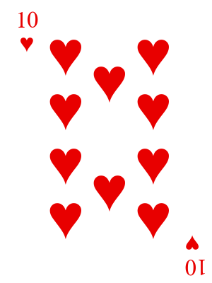

# pcpips
Playing Card Pips - code for laying out the suit symbols for basic number playing cards.

# Simple Playing Card Generator

This Python script generates the layout of standard playing cards using Matplotlib. It handles the placement of pips (the small symbols) and optional corner numbers and symbols. **This script serves as a template for creating the core design of playing cards**—you can easily add your own custom face cards or additional design elements.

## Features

- Generate standard playing card layouts with pips in the center.
- Optionally include numbers and suit symbols in the corners.
- Customize font, colors, and layout.
- Save cards as PNG images with customizable output directory.

## Requirements

- Python 3.x
- Matplotlib

## Usage

1. **Clone the repository:**

   ```bash
   git clone https://github.com/dwiddows/pcpips.git
   cd pcpips
   ```

 2. **Install the required packages:**

 ```bash
 pip install matplotlib
```

3. **Run the script:**

```bash
   python draw_pips.py --output-dir=playing_cards_corners --corners
```

This will generate playing cards with corner symbols and save them in the playing_cards directory.

## Example Output

The cards generated by this script are saved as PNG images. Here’s an example of the 10 of Hearts:



## License

This project is licensed under the MIT License - see the [LICENSE](LICENSE) file for details.

## Acknowledgments

This code was written collaboratively with [ChatGPT](https://openai.com/chatgpt) by OpenAI. Special thanks to ChatGPT for providing helpful guidance and code suggestions throughout the development of this project.

## Advanced Card Design Tools

For more sophisticated card design projects, you might want to explore these tools:
- [nanDECK](http://www.nandeck.com/)
- [Squib](https://squib.rocks/)
- [Component Studio 2](https://component.studio/)
- [Inkscape](https://inkscape.org/)
